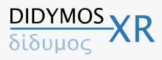

# DIDYMOS-XR

DIDYMOS-XR (DIgital, DYnaMic and respOnsible twinS for XR) is a three-year EU funded project that focuses on advancing the state of the art of enabling technologies that will allow creating large-scale digital twins, synchronised in real-time with the real world.

Find more information on the [DIDYMOS-XR Website](https://www.didymos-xr.eu).

## Acknowledgement

DIDYMOS-XR receives funding from the European Union's Horizon Europe research and innovation programme. 

